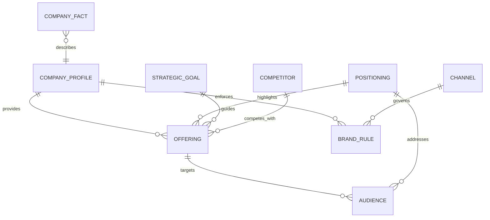
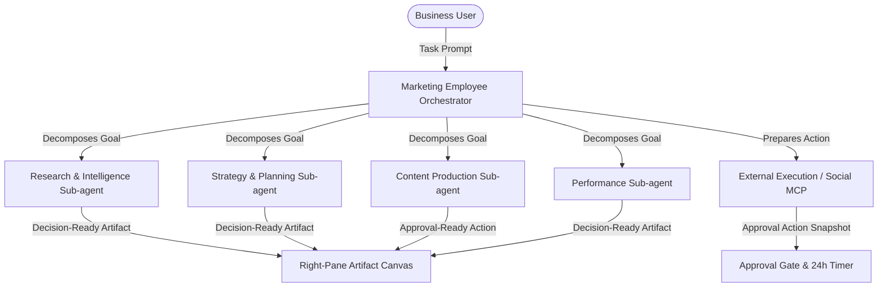
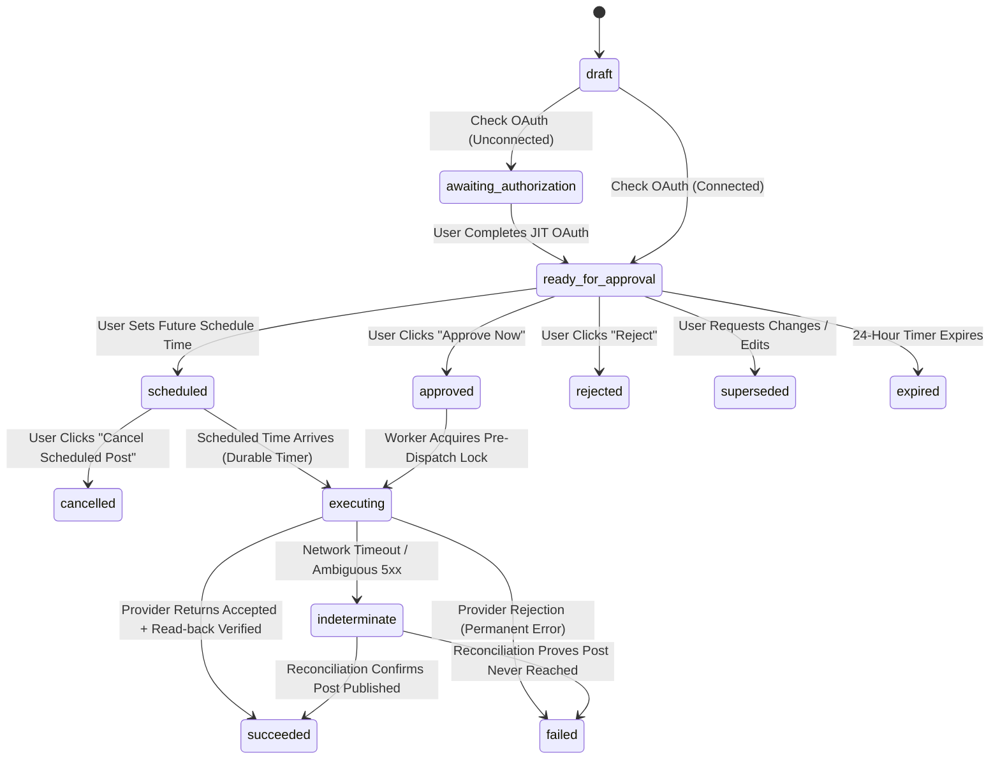

# BusMora: Master System Specification & Technical Architecture

> **Document Status**: Definitive, Authoritative Master Specification  
> **Release Target**: Production-Ready Marketing Employee (MVP)  
> **Team & Timeline**: Four Students, Six Months (24 Weeks), leveraging AI-assisted engineering  
> **Geographic Anchor**: Single-region deployment in Frankfurt (`eu-central-1`)  
> **Last Updated**: 2026-10-07

---

## Table of Contents

1. [Executive Summary & Core Platform Mission](#1-executive-summary--core-platform-mission)
2. [Core Domain Model & Glossary](#2-core-domain-model--glossary)
3. [Dual-Portal Journeys & UX Contracts (`busmora-web`)](#3-dual-portal-journeys--ux-contracts-busmora-web)
4. [Business Brain: Storage, Ingestion & Two-Stage GraphRAG](#4-business-brain-storage-ingestion--two-stage-graphrag)
5. [Marketing Employee Contract & Sub-Agent Architecture](#5-marketing-employee-contract--sub-agent-architecture)
6. [Approval-Governed External Execution, Scheduling & Social Publishing MCP Connector](#6-approval-governed-external-execution-scheduling--social-publishing-mcp-connector)
7. [System Architecture, Service Topology & Streaming](#7-system-architecture-service-topology--streaming)
8. [Multi-Tenancy, Security & KMS Credential Vault](#8-multi-tenancy-security--kms-credential-vault)
9. [Internal Quality Gate & Human-in-the-Loop Evaluation](#9-internal-quality-gate--human-in-the-loop-evaluation)
10. [24-Week Delivery Roadmap & 4-Student Ownership Matrix](#10-24-week-delivery-roadmap--4-student-ownership-matrix)
11. [Platform Extensibility & Future-Role Verification](#11-platform-extensibility--future-role-verification)

---

## 1. Executive Summary & Core Platform Mission

### 1.1 Strategic Positioning
BusMora is an **AI Employee Platform** designed for startups and growing businesses that require recurring operational and marketing capacity but lack the budget to hire specialized full-time staff. 

Rather than presenting an unconstrained visual workflow builder or hardcoding one-off automations, BusMora operates on a structured, role-based AI Employee paradigm:
- **Platform Admins** assemble and configure specialized, production-ready AI Employees using engineering-registered building blocks (Sub-agents, deterministic Tools, and MCP connectors) via an internal Admin Dashboard.
- **Business Owners & Authorized Humans** hire pre-configured Employees into their private Workspace, onboard company context into a provenance-backed **Business Brain**, delegate complex tasks, and oversee external actions under **strict, non-negotiable human approval**.

### 1.2 Beachhead Product: The Marketing Employee
The platform launches with an uncompromising, production-ready **Marketing Employee** as its strategic first release (MVP). The Marketing Employee manages five core responsibility areas:
1. Research & Intelligence
2. Strategy & Planning
3. Content Production & Channel Adaptation
4. Performance Interpretation (guaranteed structured CSV intake)
5. External Execution (one text-only post to an authorized organization-owned social channel, e.g. LinkedIn or Facebook Page, via a general Social Publishing MCP connector)

### 1.3 Core Engineering Invariants
1. **Human-in-the-Loop Governance**: The system can never autonomously publish content, alter live campaigns, spend money, or write directly to Canonical Company Knowledge. Every external side effect requires explicit, immutable human approval.
2. **Durable Orchestration (Temporal-First)**: All long-running tasks, approvals, 24-hour expiration timers, and external execution steps are orchestrated using **Temporal**. There is **no separate message broker** (no Kafka, RabbitMQ, Celery, or SQS).
3. **Multi-Model Data Plane**: Specialized datastores handle specialized data planes:
   - **PostgreSQL**: Relational transactional domain state, tasks, approvals, memberships, audit logs.
   - **Neo4j**: Business Brain structured knowledge graph (Cypher queries).
   - **Qdrant**: Vector embeddings for hybrid semantic retrieval.
   - **Amazon S3**: Raw documents, web crawl HTML snapshots, uploaded CSVs.
   - **Redis**: Caching, rate limiting, and durable SSE replay stream buffers.
4. **Security & Cryptographic Isolation**: Tenant credentials and OAuth tokens are encrypted using **AWS KMS envelope encryption** with a Workspace Encryption Context. Platform Admins have **zero standing access** to tenant data planes, brain items, or secrets.
5. **Human-Led Evaluation Authority**: Release readiness is governed by **Human Review** over 84 representative runs across 3 hidden Truth Packets in LangSmith, backed by deterministic boundary assertions.

### 1.4 Target Customer Profile & Discovery Screen Criteria
- **Priority Customer Cohort**: Digital-first B2B professional-services firms with 10–49 employees (favoring 20–49). A qualified company has:
  - A public website and differentiated service offering.
  - A named owner/operator or lean solo marketer responsible for marketing.
  - An active content or outbound channel (e.g. LinkedIn or company blog).
  - At least two relevant marketing/performance sources (CRM, analytics, email, social, or search).
  - Read-only, non-sensitive performance data it can share (e.g. performance CSVs).
  - No dedicated multi-person marketing department.
- **Comparator Cohort**: Digital-commerce brands (used as a falsifying comparator to test attribution and execution substitutes, not assumed as the primary beachhead).
- **Discovery Screen Rule**: Conduct 3–5 discovery interviews per cohort during Month 1. Reject any prospective company whose primary demand is autonomous ad spend or unapproved publishing.

---

## 2. Core Domain Model & Glossary

The BusMora platform adheres to strict, domain-neutral terminology across all four services:

| Term | Formal Definition & Boundary |
|---|---|
| **Workspace** | The fundamental tenant boundary for exactly one Business (`1 Business = 1 Workspace = 1 Tenant`). Owns all resources: Brain knowledge, Employee activations, integrations, tasks, artifacts, and audit trails. |
| **Workspace Membership** | The association binding a User to a Workspace. A User may belong to multiple Workspaces, but every request executes within one explicitly selected active Workspace. All members share uniform permissions in the MVP. |
| **Platform Admin** | Internal platform operator (`busmora.com/admin/*`) who manages global Employee definitions, prompts, and registered building blocks. Has **zero access** to Workspace-owned task contents, Brain items, or credentials. |
| **Authorized Company Human** | Any authenticated Workspace member with authority to promote/retire Canonical Knowledge Items and approve external Approval Actions. (In the MVP, all active Workspace members hold this role). |
| **Employee** | The primary user-facing orchestrator (e.g., Marketing Employee). Decomposes business requests, coordinates Sub-agents and Tools, manages context, and owns task delivery. |
| **Employee Configuration** | The Admin-managed definition of an Employee: name, description, system prompt, approval policy, and assigned Sub-agents, Tools, and MCP bindings. Published as immutable revisions (`rev-1`, `rev-2`). |
| **Sub-agent** | A modular, code-defined, versioned specialized worker in the codebase executing a bounded graph workflow (e.g., `ResearchSubAgent`). Sub-agent workflows and tool requirements are code-defined and cannot be altered by admins or clients. |
| **Tool** | A deterministic codebase function performing bounded computation or data manipulation without LLM orchestration (e.g., calculations, metric formatters). |
| **MCP Connector** | External integration exposed through the Model Context Protocol (e.g., Social Publishing MCP). Hardcoded and narrowly evaluable. |
| **Business Brain** | The company-scoped, provenance-backed repository of Canonical Company Knowledge. Organized across 9 predefined entity types. |
| **Knowledge Item** | The atomic current-state unit of Canonical Company Knowledge. Holds one canonical statement, entity type, provenance links, status (`active` or `retired`), and confirmation metadata. UI hard-deletion is excluded. |
| **Candidate Knowledge** | Extracted or proposed knowledge items awaiting human confirmation in the `/brain/candidates` inbox (`pending`, `rejected`, or promoted to `active`). |
| **Decision-Ready Artifact** | Structured output (research brief, campaign plan, performance diagnosis) sufficient for an authorized human to make a business decision without re-doing the research. |
| **Approval Action** | An immutable snapshot of a proposed external side effect containing exact target, payload, preview, and 24h expiration timer. Must be explicitly approved before execution. |
| **Connected Organization Target** | An organization-owned external Page or account that a Business tenant controls and has explicitly authorized for a supported integration action (e.g., company Facebook/LinkedIn Page). It is distinct from an individual's personal profile. |
| **Workspace Connection** | A Workspace-owned integration authorization created when an individual User completes provider consent for a Connected organization target. Its scopes, authorization state, and KMS-encrypted credentials belong to the Workspace; its consenting User and target are retained for audit. |
| **Brain Entity Type** | A predefined structured kind of Knowledge Item (Company Profile, Offering, Audience, Brand Rule / Preference, Positioning / Message, Strategic Decision / Goal, Channel, Competitor, Company Fact). May participate only in supported relationships; arbitrary user-defined schemas are prohibited. |
| **Task Record** | The immutable historical record of a task, including prompts, transcripts, artifacts, approvals, execution logs, and user feedback. |

---

## 3. Dual-Portal Journeys & UX Contracts (`busmora-web`)

Both portals reside within a single Next.js 15 monorepo (`busmora-web`) hosted entirely under `busmora.com`, sharing a standardized design system (Tailwind CSS, Radix UI), but maintaining strictly separated route trees, sessions, and navigation shells (Platform Admin under `busmora.com/admin/*` and Client Workspace under `busmora.com/w/{slug}/*`).

```
┌────────────────────────────────────────────────────────────────────────┐
│                              busmora-web                               │
├───────────────────────────────────┬────────────────────────────────────┤
│   busmora.com/admin/*             │   busmora.com/w/{slug}             │
│   (Platform Admin Portal)         │   (Client Workspace Portal)        │
│   - Employee Catalog              │   - Hybrid Onboarding (/onboarding)│
│   - Assembly & Draft Editing Form │   - Brain Explorer (/brain)        │
│   - Building Block Registry       │   - Candidate Inbox (/brain/cand.) │
│   - Immutable Revision Publishing │   - AI Employees (/employees)      │
│   - ZERO Tenant Data Access       │   - Dual-Pane Task Workspace       │
│                                   │   - Settings & JIT OAuth Cards     │
│                                   │   - Audit Logs (/audit)            │
└───────────────────────────────────┴────────────────────────────────────┘
```

### 3.1 Platform Admin Portal (`busmora.com/admin/*`)
- **Route Tree**: `/admin`, `/admin/employees`, `/admin/employees/new`, `/admin/employees/:id/edit`, `/admin/registry/building-blocks`.
- **Employee Composition Form**:
  - `Name`: e.g., "Marketing Employee".
  - `Description`: Business-facing overview shown in client catalog.
  - `Instructions / System Prompt`: Role boundaries, tone guidelines, execution directives.
  - `Approval Policy`: Configured approval threshold (e.g., "Always Require Approval for External Actions").
  - `Assigned Sub-agents`, `Tools`, and `MCP Bindings`: Independent multi-select checkboxes populated from registered codebase building blocks.
- **Publishing & Versioning Semantics**:
  - Admin edits create drafts.
  - Clicking "Publish" creates an immutable configuration revision in PostgreSQL (e.g., `revision_number = 2`).
  - Active in-flight tasks remain pinned to the configuration revision active when the task started.
- **Data Boundary Guarantee**: Platform Admin screens have zero database relationships or API routes connecting to tenant Brain items, chat transcripts, task artifacts, or integration secrets.

### 3.2 Client Workspace Portal (`busmora.com/w/{workspace_slug}/...`)

#### 1. Hybrid Guided Onboarding with Skip (`/onboarding`)
- Collects `Company Name` and an explicitly confirmed `Public Company Website URL`.
- Submitting immediately triggers the background **Temporal Onboarding Workflow**:
  `Website URL → Shallow Crawler (max 10 pages) → Extraction → Candidate Knowledge → User Review`.
- The user is not blocked; they can immediately enter the Workspace dashboard.
- A persistent notification banner alerts the user when candidate extraction completes: *"Your initial company knowledge is ready for review."*

#### 2. Canonical Knowledge Explorer (`/brain`)
- Visual explorer organized strictly around the **9 predefined Brain entity types**.
- Users can view current active knowledge, add structured items manually, edit existing items, or retire outdated items.
- UI hard deletion is explicitly excluded; retiring an item excludes it from GraphRAG retrieval while preserving audit provenance.

#### 3. Candidate Review Inbox (`/brain/candidates`)
- Dedicated inbox displaying extracted or proposed knowledge from web crawls, document uploads, or task conversations.
- Presents candidate statement, source excerpt, confidence, and side-by-side comparison with existing matching canonical items.
- Item-level review actions:
  - **Approve as New**: Promotes candidate into a new active Knowledge Item.
  - **Edit & Approve**: Allows user correction before promotion.
  - **Edit & Approve as Update**: Overwrites the current canonical value with audit history.
  - **Reject**: Marks candidate rejected.
  - **Leave Pending**: Defers decision.
- Bulk approval is intentionally excluded to ensure data integrity.

#### 4. Dual-Pane Task Workspace (`/tasks/:task_id`)
The primary operational interface for collaborating with AI Employees:
- **Left Pane (40–50% width) — Conversational Stream**:
  - Interactive chat stream with token-level streaming.
  - Real-time step progress indicators (e.g., *"Researching competitor pricing..."*).
  - Inline JIT OAuth Connect Cards when integration credentials are required.
  - In-stream approval cards showing actionable buttons (`Approve`, `Request Changes`, `Reject`).
- **Right Pane (50–60% width) — Decision Canvas & Action Inspector**:
  - Full-fidelity rendering of primary **Decision-Ready Artifacts** (Markdown reports, strategy briefs, formatted tables).
  - Exact preview inspector for **Approval Actions** (full text of the proposed social post, target organization channel name, scheduled time, and payload inspector).
- **Pinned Execution**: Displays the immutable Employee Configuration revision pinned to the task (e.g., `Marketing Employee v2`).
- **Reconnectable SSE**: Implements `Last-Event-ID` header reconnects against Redis Stream buffers; network disconnects never kill running Temporal workflows.

#### 5. Integration Management (`/settings/integrations` & JIT in-stream)
- **Settings View**: Displays connection state (`connected`, `unconnected`, `suspended`), connected organization target name (e.g., "Acme Corp Page"), consenting user email, and last verified timestamp.
- **Just-In-Time (JIT) Connection**: If an employee prepares an action requiring an unconnected integration, an interactive card renders in the chat stream. Completing OAuth in an external popup resumes the held Temporal workflow automatically.

#### 6. Operational History (`/tasks`) vs. Workspace Audit Log (`/audit`)
- `/tasks`: Filterable operational list of tasks, completed artifacts, conversational transcripts, and human feedback scoring.
- `/audit`: Immutable, append-only security and governance audit trail recording every canonical knowledge promotion, approval decision, external execution attempt, and OAuth state change. Inaccessible to Platform Admins.

---

## 4. Business Brain: Storage, Ingestion & Two-Stage GraphRAG

The Business Brain provides provenance-backed, curated company memory. It is neither an uncurated vector dump nor an automatic conversation logger.

### 4.1 Predefined Entity Types & Knowledge Graph Schema (Neo4j)
Workspace members and AI Employees operate within 9 predefined entity types:



1. `Company Profile`: Singleton business facts (company name, mission, stage, headquarters).
2. `Offering`: Products, services, core features, pricing tiers.
3. `Audience`: Ideal Customer Profile (ICP), target job titles, buyer personas, pain points.
4. `Brand Rule / Preference`: Brand voice guidelines, prohibited terms, formatting standards.
5. `Positioning / Message`: Value propositions, elevator pitches, key differentiators.
6. `Strategic Decision / Goal`: Active quarterly objectives, target industries, strategic priorities.
7. `Channel`: Official communication channels, publication guidelines, posting limits.
8. `Competitor`: Known competitors, market positioning, competitive battlecards.
9. `Company Fact`: Constrained fallback for durable business facts fitting no other category.

### 4.2 Ingestion Routes & Provenance Chain
1. **Onboarding Website Crawl**: Bounded crawler inspects up to 10 public pages on the confirmed company domain, respects `robots.txt`, and stores raw HTML snapshots in S3 (`s3://busmora-sources/{workspace_id}/crawler/...`).
2. **Workspace Member Manual Input**: Structured facts entered directly via `/brain`.
3. **Company Document Upload**: Uploaded files (PDFs, docs, CSVs) are stored in S3; metadata ledger is recorded in PostgreSQL `source_documents`.
4. **Employee-Derived Learning**: During task execution, employees identify reusable insights and emit candidate proposals with citations to `/brain/candidates`.

**Strict Provenance Chain**:
`Canonical Knowledge Item (Neo4j)` ──► `Source Document Record (PostgreSQL)` ──► `Raw Source Artifact (S3)`

### 4.3 Two-Stage Hybrid GraphRAG Engine
During task execution, `busmora-ai` retrieves company context using a two-stage hybrid pipeline:

```
Task Query + Workspace ID
          │
          ▼
┌───────────────────────────────────────────────┐
│ Stage 1: Vector Retrieval (Qdrant)           │
│ - Filter: workspace_id == active_workspace    │
│ - Semantic similarity search over active      │
│   Knowledge Item embeddings                   │
│ - Returns Top-K seed Knowledge Item IDs       │
└──────────────────────┬────────────────────────┘
                       │ Seed IDs
                       ▼
┌───────────────────────────────────────────────┐
│ Stage 2: Subgraph Expansion (Neo4j)           │
│ - Cypher query expands 1–2 hops around seeds  │
│ - Traverses connected Audiences, Offerings,   │
│   Brand Rules, and Competitor nodes           │
│ - Enforces workspace_id isolation on all nodes│
│ - Collects full provenance & freshness info   │
└──────────────────────┬────────────────────────┘
                       │
                       ▼
Context Assembly for LangGraph System Prompt
```

### 4.4 Experimental Control Baseline
To measure the value of the Business Brain, `busmora-ai` maintains a parallel **Document-Only Control Route**:
- **Control Path**: Chunks raw S3 documents directly into Qdrant vectors without structured entity extraction or graph relations.
- **Evaluation Purpose**: In the Quality Gate, paired runs compare treatment (Two-Stage GraphRAG) against control (Raw S3 Chunk Retrieval), tracking clarification turns, factual corrections, brand contradictions, and rework effort.

---

## 5. Marketing Employee Contract & Sub-Agent Architecture

### 5.1 Bounded Contract & Five Responsibility Areas



1. **Research & Intelligence Sub-agent**: Performs competitor, market, and audience research using Brain context and bounded public web search. Produces a Decision-Ready Research Brief.
2. **Strategy & Planning Sub-agent**: Synthesizes marketing, campaign, and content strategy plans grounded in company goals and brand rules.
3. **Content Production & Adaptation Sub-agent**: Drafts brand-aligned copy, headlines, and channel-adapted post variations.
4. **Performance Interpretation Sub-agent**: Ingests structured performance data. **CSV upload is the guaranteed release-one source**. Validates data schemas, analyzes trends, diagnoses underperformance, and outputs strategic recommendations.
5. **External Execution Engine**: Prepares, validates, and executes approved posts to the company's authorized social channel (e.g. LinkedIn or Facebook Page) via the Social Publishing MCP.

### 5.2 ModelGateway & LLM Execution
All LLM calls transit through an internal `ModelGateway` in `busmora-ai`:
- Enforces Pydantic structured output validation.
- Routes prompts to primary models (e.g., Anthropic Claude 3.5 Sonnet / OpenAI GPT-4o) with automatic retry and secondary provider fallback.
- Emits execution metrics, token counts, and full prompt/completion logs to **LangSmith**.

---

## 6. Approval-Governed External Execution, Scheduling & Social Publishing MCP Connector

### 6.1 Immutable Approval Action Lifecycle



### 6.2 Scheduled Jobs & Deferred Execution (Native Temporal Orchestration)

BusMora provides first-class support for both one-off deferred actions (e.g., *"Publish tomorrow at 4:00 PM"*) and recurring cron jobs without introducing external scheduler daemons, crontabs, or message queues. Temporal natively provides durable, fault-tolerant timers.

#### 1. Type A: Deferred Action Execution (e.g., "Publish Tomorrow at 4:00 PM")
- **Approval Hold**: In the Task Workspace, the user can choose to publish immediately or select a future publication timestamp (`scheduled_for = '2026-10-08T16:00:00Z'`).
- **Domain State**: `approval_actions.status` transitions from `ready_for_approval` to `scheduled`.
- **Temporal Durable Sleep**: The `TaskExecutionWorkflow` receives `signal_approve_action(scheduled_for)`:
  - Computes exact duration: `delay = (scheduled_for - workflow.now()).total_seconds()`.
  - Executes durable sleep: `await workflow.wait_condition(lambda: is_cancelled, timeout=timedelta(seconds=delay))`.
  - **Survives Outages**: The timer is held durably in Temporal server state. Worker processes or servers can restart, crash, or scale to zero without losing the schedule.
- **In-Flight Cancellation / Rescheduling**: If the user clicks *"Cancel Scheduled Post"* in `/tasks` or `/settings/integrations`:
  - `busmora-api` sends `signal_cancel_action` to Temporal.
  - The workflow wakes up immediately, transitions domain state to `cancelled`, and terminates cleanly without publishing.
- **Pre-Dispatch Preflight Check**: When the scheduled timestamp arrives (e.g., 4:00 PM), the worker wakes up and executes a preflight check to verify OAuth token validity and target permissions before acquiring the idempotency lock. If the token expired or was revoked during the wait, the action transitions to `awaiting_authorization` with an urgent user alert rather than failing blindly.

#### 2. Type B: Recurring Scheduled Tasks (Cron / Periodic Workflows)
- **Temporal Schedules**: Managed in `busmora-api` using the official Temporal TypeScript SDK (`client.schedule.create`).
- **Use Cases**: Periodic operations such as *"Run competitor intelligence every Monday at 9:00 AM"* or *"Generate weekly marketing performance digest every Friday at 5:00 PM"*.
- **Strict Human Governance Invariant**:
  - The AI Employee autonomously runs research, analyzes data, and synthesizes drafts (producing **Decision-Ready Artifacts**).
  - **The Employee NEVER publishes autonomously.**
  - If a recurring task prepares an external social post, it emits an `Approval Action` in state `ready_for_approval` and sends an email/dashboard notification: *"Your scheduled weekly draft is ready for review. Click to inspect and approve."*

### 6.3 Pre-Dispatch Idempotency, Verification & Reconciliation
1. **Pre-Dispatch Lock**: Before issuing any external provider API call, `busmora-workers` writes an `execution_attempt` record with a unique `idempotency_key` into PostgreSQL.
2. **24-Hour Approval Expiration**: A durable Temporal timer triggers after 24 hours while an action is in `ready_for_approval`. If not approved within 24 hours, it transitions to `expired` and cannot execute without generating a fresh snapshot.
3. **Verified Success**: An action transitions to `succeeded` **only after**:
   - The provider API returns an accepted HTTP 200/201 response with provider resource ID/URN.
   - A subsequent read-back verification call confirms that the post is active and publicly visible.
4. **Indeterminate Recovery**: If a network timeout or 5xx error occurs after dispatch, the worker transitions state to `indeterminate`, halts retries, and queries the provider's recent posts to fingerprint and reconcile whether the post actually published. It never blindly re-posts.
5. **Remediation**: Correcting or deleting a published post is never an automatic rollback; it is initiated as a separate, human-approved remedy action.

### 6.4 General Social Publishing MCP Connector (`mcp:social_publishing:v1`)

The external execution engine is architected around a **general, provider-agnostic Social Publishing MCP contract**. The platform is not tied to any single social provider:

```
┌────────────────────────────────────────────────────────────────────────┐
│             General Social Publishing MCP Contract                     │
├────────────────────────────────────────────────────────────────────────┤
│ - get_connection_status(target_id)       ──► Health, scopes & expiry   │
│ - list_authorized_targets()              ──► Organization Pages/Channels│
│ - preflight_action(payload, target_id)   ──► Validate format & limits  │
│ - execute_approved_action(approval_id)   ──► Dispatch with idempotency │
│ - get_execution_status(provider_id)      ──► Read-back verification    │
│ - remediate(action_id, remedy_type)      ──► Approved edit or delete   │
└───────────────────────────────────┬────────────────────────────────────┘
                                    │
           ┌────────────────────────┴────────────────────────┐
           ▼                                                 ▼
┌───────────────────────────────┐ ┌───────────────────────────────────────┐
│     LinkedIn Page Adapter     │ │          Meta/Facebook Adapter        │
│  - Target: Organization Page  │ │  - Target: Facebook Page              │
│  - Auth: w_organization_social│ │  - Auth: pages_manage_posts           │
│  - API: POST /rest/posts      │ │  - API: POST /{page-id}/feed          │
│  - Read-back: GET /rest/posts │ │  - Read-back: GET /{post-id}          │
└───────────────────────────────┘ └───────────────────────────────────────┘
```

1. **Organization-Owned Target Boundary**:
   - The connector strictly targets connected, organization-owned channels (e.g., LinkedIn Organization Pages, Facebook Pages).
   - Personal profile publishing is strictly prohibited across all providers to protect user privacy and corporate brand safety.
2. **Provider Independence**:
   - The core platform, approval state machine, preview canvas, and Temporal workflows are 100% provider-agnostic.
   - Whether publishing to LinkedIn, Facebook, or another supported social platform, the execution flow and domain state transitions are identical.
3. **Pilot Provider Selection & Fallback**:
   - The release-one pilot utilizes the platform adapter best aligned with pilot customer discovery (e.g. LinkedIn Organization Page for B2B professional services firms, or Meta/Facebook Page for consumer/commerce firms).
   - Switching or adding providers is an isolated adapter implementation in `busmora-workers` requiring zero modifications to the core platform.
4. **Token Lifecycle & Reauthorization**:
   - Provider OAuth tokens are envelope-encrypted using AWS KMS with the Workspace Encryption Context.
   - The platform tracks token validity and surfaces proactive reauthorization prompts in `/settings/integrations` and inline JIT task cards before tokens expire.

---

## 7. System Architecture, Service Topology & Streaming

The BusMora platform is partitioned into **four distinct application repositories/services**:

```
┌─────────────────────────────────────────────────────────────────────────────────────────┐
│                                   busmora-web (Next.js)                                 │
│  - Portals: busmora.com/admin/* & busmora.com/w/{slug}                                  │
│  - SSE Client: Reconnects via Last-Event-ID header                                      │
└────────────────────────────────────┬────────────────────────────────────────────────────┘
                                     │ HTTP REST / SSE Stream
                                     ▼
┌─────────────────────────────────────────────────────────────────────────────────────────┐
│                                   busmora-api (NestJS)                                  │
│  - Auth: Custom Argon2id + JWT + Redis Refresh Tokens                                   │
│  - Multi-Tenancy: 1 Business = 1 Workspace = 1 Tenant                                   │
│  - Relational ORM: Drizzle ORM -> PostgreSQL                                            │
│  - Temporal Client: Starts Workflows with Frozen Config JSON Snapshots                  │
│  - SSE Gateway: Subscribes to Redis Streams -> Forwards events to Web                   │
└───────────────────┬─────────────────────────────────┬───────────────────────────────────┘
                    │ Starts Workflows / Signals       │
                    ▼                                 │
┌───────────────────────────────────────┐             │
│       busmora-workers (Python)        │             │
│  Temporal SDK Workers                 │             │
│  - Workflows: TaskExecution, Onboard  │             │
│  - Signals: approve, revise, oauth    │             │
│  - 24h Approval Expiration Timers     │             │
│  - Social Publishing MCP Adapter      │             │
└───────────────────┬───────────────────┘             │
                    │ Internal REST Call              │ Redis Stream Buffer & Pub/Sub
                    ▼                                 ▼
┌───────────────────────────────────────┐   ┌─────────────────────────────────────────────┐
│          busmora-ai (Python)          │   │                 Data Plane                  │
│  FastAPI Runtime & ModelGateway       │   │  - PostgreSQL: Transactional Domain State   │
│  - LangGraph Marketing Agents         │──►│  - Neo4j: Business Brain Knowledge Graph    │
│  - Two-Stage GraphRAG Engine          │   │  - Qdrant: Vector Embeddings                │
│  - Shallow Web Crawler (max 10 pages) │   │  - S3: Raw Sources (HTML snapshots, CSVs)   │
│  - LangSmith Evaluation Runner        │   │  - Redis: Cache, SSE Buffers & Replay Stream│
└───────────────────────────────────────┘   └─────────────────────────────────────────────┘
```

### 7.1 Durable Workflow Orchestration (Temporal)
- **Temporal Environment**: **Temporal Cloud** is used for development, staging, and the 6-month pilot, eliminating operational overhead. A production-ready runbook specifies self-hosted deployment on dedicated servers for long-term production.
- **No Separate Message Broker**: Temporal handles durable task distribution, activity retries, signal holds, and timers. No Kafka, RabbitMQ, Celery, or SQS is deployed.
- **Frozen Configuration Pinning**: When a task starts, `busmora-api` serializes the active Employee Configuration into an immutable JSON payload and passes it into the Temporal Workflow input. The worker passes this snapshot directly to `busmora-ai`, ensuring tasks are deterministic and decoupled from future configuration edits.

### 7.2 Event Streaming & Reconnection Architecture
1. `busmora-ai` publishes execution events (tokens, tool progress, artifact updates, approval cards) to a **Redis Stream** keyed by `task_id:{id}`.
2. `busmora-api` subscribes to Redis and forwards events to `busmora-web` via **Server-Sent Events (SSE)**.
3. Each event carries an incrementing sequence ID (`id: 1, 2, 3...`).
4. If a browser disconnects, the Temporal workflow continues unabated. Upon reconnecting, the client passes `Last-Event-ID: {n}`, and `busmora-api` replays missed events from the Redis Stream buffer before resuming live delivery.

### 7.3 Data Plane Storage Specifications & Relational Schemas

#### 1. PostgreSQL Relational Schema (Drizzle ORM in `busmora-api`)
The PostgreSQL transactional database is strictly partitioned by `workspace_id`:
- `workspaces`: `id` (UUID PK), `slug` (varchar unique), `name` (varchar), `status` (enum: active, suspended), `created_at` (timestamp).
- `users`: `id` (UUID PK), `email` (varchar unique), `password_hash` (Argon2id varchar), `is_platform_admin` (boolean default false), `created_at` (timestamp).
- `workspace_memberships`: `id` (UUID PK), `workspace_id` (UUID FK), `user_id` (UUID FK), `role` (enum: member), `created_at` (timestamp).
- `employees`: `id` (UUID PK), `key` (varchar unique, e.g., 'marketing'), `name` (varchar), `status` (enum: active, inactive).
- `employee_configurations`: `id` (UUID PK), `employee_id` (UUID FK), `revision_number` (int), `name` (varchar), `description` (text), `system_prompt` (text), `approval_policy` (jsonb), `assigned_sub_agents` (jsonb array), `assigned_tools` (jsonb array), `assigned_mcps` (jsonb array), `is_published` (boolean), `created_at` (timestamp).
- `tasks`: `id` (UUID PK), `workspace_id` (UUID FK), `title` (varchar), `prompt` (text), `status` (enum: pending, running, completed, failed, cancelled), `configuration_snapshot` (jsonb frozen revision), `created_by` (UUID FK users), `created_at` (timestamp).
- `task_records`: `id` (UUID PK), `task_id` (UUID FK unique), `workspace_id` (UUID FK), `artifacts` (jsonb array), `transcript` (jsonb), `feedback_score` (int nullable: 1-5), `feedback_comment` (text nullable), `completed_at` (timestamp).
- `approval_actions`: `id` (UUID PK), `task_id` (UUID FK), `workspace_id` (UUID FK), `action_type` (varchar), `status` (enum: draft, awaiting_authorization, ready_for_approval, approved, scheduled, executing, succeeded, failed, indeterminate, rejected, cancelled, expired, superseded), `target_channel` (varchar), `preview_payload` (jsonb), `normalized_payload` (jsonb), `scheduled_for` (timestamp nullable), `expires_at` (timestamp), `approved_by` (UUID FK users nullable), `approved_at` (timestamp nullable), `created_at` (timestamp).
- `execution_attempts`: `id` (UUID PK), `approval_action_id` (UUID FK), `workspace_id` (UUID FK), `idempotency_key` (varchar unique), `attempt_number` (int), `provider_reference` (varchar nullable), `status` (enum), `executed_at` (timestamp).
- `workspace_integrations`: `id` (UUID PK), `workspace_id` (UUID FK), `provider` (varchar), `status` (enum: connected, unconnected, suspended), `target_name` (varchar), `target_id` (varchar), `scopes` (text array), `encrypted_tokens` (text, KMS envelope encrypted), `credential_version` (int), `consenting_user_id` (UUID FK users), `expires_at` (timestamp), `last_verified_at` (timestamp).
- `source_documents`: `id` (UUID PK), `workspace_id` (UUID FK), `source_type` (enum: crawler, upload, member_input), `s3_key` (varchar), `original_filename` (varchar), `content_hash` (varchar), `metadata` (jsonb), `created_at` (timestamp).
- `audit_events`: `id` (UUID PK), `workspace_id` (UUID FK), `actor_id` (UUID FK users nullable), `event_type` (varchar), `target_type` (varchar), `target_id` (UUID nullable), `payload_snapshot` (jsonb), `created_at` (timestamp, append-only, immutable).

#### 2. Amazon S3 Storage Layout
Raw evidentiary documents, crawl snapshots, and uploads are partitioned deterministically:
`s3://busmora-sources/{workspace_id}/{source_type}/{timestamp}_{filename}`
- Example Crawler Snapshot: `s3://busmora-sources/ws-8f4b/crawler/20261007T120000Z_homepage.html`
- Example Uploaded Performance CSV: `s3://busmora-sources/ws-8f4b/upload/20261007T143000Z_q3_performance.csv`

#### 3. Neo4j Knowledge Graph Schema (`busmora-ai`)
- **Node Labels**: Mapped to the 9 Brain Entity Types (`CompanyProfile`, `Offering`, `Audience`, `BrandRule`, `Positioning`, `StrategicGoal`, `Channel`, `Competitor`, `CompanyFact`).
- **Required Node Properties**: `workspace_id` (string indexed), `item_id` (UUID indexed), `statement` (text), `status` (enum: 'active', 'retired'), `source_doc_id` (UUID), `confidence` (float), `created_at` (datetime), `updated_at` (datetime).
- **Graph Multi-Tenancy**: Every Cypher read query strictly enforces `WHERE n.workspace_id = $workspace_id AND n.status = 'active'`.

#### 4. Qdrant Vector Collection (`busmora-ai`)
- **Collection Name**: `business_brain_knowledge_items`.
- **Vector Parameters**: Size 1536 (`text-embedding-3-small`), Distance metric `Cosine`.
- **Payload Schema**: `{ "workspace_id": "...", "item_id": "...", "entity_type": "...", "statement": "...", "status": "active" }`.
- **Filtered Index**: Indexed on `workspace_id` (keyword) and `status` (keyword) for low-latency multi-tenant vector searches.

---

## 8. Multi-Tenancy, Security & KMS Credential Vault

### 8.1 Tenancy & Authorization Model
- **Boundary**: Strict Workspace isolation (`workspace_id`).
- **Uniform MVP Permissions**: Every active Workspace member is an Authorized Company Human with rights to view tasks, approve actions, and manage Brain items. Custom RBAC is deferred.
- **Platform Admin Isolation**: Platform Admins have zero database foreign keys or API paths connecting to Workspace-owned task contents, Brain items, or audit logs.

### 8.2 AWS KMS Envelope Encryption
All third-party OAuth access tokens and credentials are cryptographically protected using **AWS KMS Envelope Encryption**:
- **Data Encryption Key (DEK)**: A unique DEK is generated per tenant integration.
- **Workspace Encryption Context**: Encryption calls bind an explicit encryption context:
  `EncryptionContext = { workspace_id: UUID, integration_id: UUID, credential_version: int }`
- Decryption succeeds only when the requesting process provides the identical `workspace_id`. Platform Admins cannot decrypt tenant credentials under any circumstances.

### 8.3 Custom Authentication Engine (`busmora-api`)
- **Password Security**: Passwords hashed using **Argon2id** with salt.
- **Session Tokens**: Short-lived JWT access tokens (15-minute expiration) carrying `user_id` and active `workspace_id`.
- **Refresh Tokens**: Cryptographically random refresh tokens stored in Redis with 7-day expiration and automatic rotation on use.
- **Guards**: NestJS enforces distinct `PlatformAdminGuard` and `WorkspaceMemberGuard` decorators.

---

## 9. Internal Quality Gate & Human-in-the-Loop Evaluation

### 9.1 Evaluation Philosophy & Authority
Release readiness is governed by **Human Review** over representative execution data in **LangSmith**. BusMora explicitly avoids complex automated evaluation platforms or automated LLM-as-a-judge release gates:

`Representative Runs (Harness)` ──► `LangSmith & Temporal Traces` ──► `Human Review` ──► `Release Gate Decision`

### 9.2 Evaluation Corpus: 84 Assessed Runs across 3 Hidden Truth Packets
Three curated **Evaluation Companies** are maintained with hidden **Truth Packets** (company context, confirmed facts, brand rules, source documents, scenario prompts):
- **48 Breadth Runs**: 8 representative scenarios × 3 companies × 2 independent runs.
- **36 Repeated-Use Runs**: 3 composite scenarios × 3 companies × 2 context conditions (baseline vs. accumulated) × 2 runs per condition.
- **Total**: **84 Assessed Runs**.

#### The 8 Representative Evaluation Scenarios:
1. **Competitor & Audience Intelligence Brief**: Grounded market research distinguishing confirmed facts from inference.
2. **Goal-Driven Campaign Plan**: Multi-stage marketing strategy aligned with business objectives and budget constraints.
3. **Brand-Grounded Content Package**: High-fidelity marketing copy adapted across channel formats without brand rule drift.
4. **Performance Diagnosis & Recommendations**: Structured CSV ingestion, metric calculation, and actionable optimization plan.
5. **Approval-Gated External Action**: Preparation of a social post, preview generation, approval hold, provider dispatch, and read-back verification.
6. **Composite Multi-Area (Research → Plan → Content)**: Research findings flowing seamlessly into strategy and content creation without lost context.
7. **Composite Multi-Area (Plan → Content → Execution)**: Strategy formulation leading directly to draft action, human approval, and dispatch.
8. **Composite Multi-Area (Performance → Revision)**: Performance CSV analysis diagnosing issues and generating a corrective campaign/content package.

### 9.3 Scored Dimensions & Rubric
Two independent human reviewers score runs in LangSmith annotation queues:
- `0` = Material contract failure.
- `1` = Material correction needed or insufficient evidence.
- `2` = Meets contract.

A tie or disagreement triggers an escalation to a third reviewer.

### 9.4 Failure Attribution Taxonomy
When a run does not pass, reviewers must categorize the suspected failure source to guide engineering triage:
- `Employee policy / configuration`: Incorrect instructions, prompt ambiguity, or flawed assembly in Admin dashboard.
- `Capability / workflow`: Bugs in a Sub-agent's internal LangGraph flow or state handling.
- `Tool / integration`: Failure in deterministic tool logic, MCP adapter, or external API response.
- `Company context`: Ambiguity, missing facts, or conflicting evidence in the Truth Packet.
- `Orchestration`: Temporal workflow timeouts, signal delivery failures, or event streaming disconnects.
- `Model variability / provider`: LLM nondeterminism, unexpected provider formatting, or rate limit throttling.
- `Evaluation fixture / data`: Flaws or inconsistencies in the Truth Packet test data itself.
- `Unknown`: Unclassifiable failure requiring deep manual debugging.

### 9.5 Non-Negotiable Gate Thresholds
To pass the Quality Gate and unlock pilot deployment:
1. **Zero Hard-Rule Violations** across all 84 runs (deterministic check: schema compliance, no unapproved external actions).
2. **At least 76 of 84 passing runs (90.48%)**.
3. **At least 80% passing within each applicable Responsibility Area**.
4. Both human reviewers assign `2` to all mandatory scenario dimensions.
5. Zero material brand contradictions or hallucinations against confirmed Truth Packet facts.
6. Treatment (GraphRAG) demonstrates ≥ 50% reduction in clarification turns and brand corrections compared to Control.
7. Output delivered as a concise Markdown summary: `QUALITY_GATE_REPORT.md`.

---

## 10. 24-Week Delivery Roadmap & 4-Student Ownership Matrix

### 10.1 4-Student End-to-End Vertical Slice Ownership Matrix

All four team members are skilled **Full-Stack + AI Engineers**. Rather than siloing team members horizontally into isolated architectural layers (e.g. Frontend-only, Backend-only), BusMora adopts a **Vertical Feature Slice Ownership Model**. Every student builds and ships complete features **End-to-End** across the entire 4-service stack:
`Next.js (busmora-web)` ──► `NestJS (busmora-api)` ──► `Temporal (busmora-workers)` ──► `LangGraph/FastAPI (busmora-ai)`

| Student / Role | Vertical End-to-End Domain | Multi-Service Deliverables & Full-Stack Responsibilities |
|---|---|---|
| **Student 1**<br>Full-Stack + AI Engineer | **Business Brain, Knowledge Ingestion & GraphRAG** | - **Web**: `/brain` Canonical Explorer, `/brain/candidates` Review Inbox, `/onboarding` guided crawl UI.<br>- **API**: Knowledge ledger, candidate review endpoints, S3 metadata records, Drizzle migrations.<br>- **Workers**: Temporal `OnboardingWorkflow`, shallow web crawling & candidate extraction activities.<br>- **AI**: Shallow crawler (10 pages), candidate extractor, Neo4j Cypher schemas, Qdrant vector collections, Two-Stage GraphRAG engine & control baseline. |
| **Student 2**<br>Full-Stack + AI Engineer | **Task Workspace, Orchestration & Real-Time Streaming** | - **Web**: Dual-pane Task Workspace left conversational pane (45%), token streaming, step progress indicators, reconnectable SSE client (`Last-Event-ID`).<br>- **API**: Task lifecycle APIs (`/tasks`), Redis SSE stream publisher/forwarder, frozen configuration snapshot generator.<br>- **Workers**: Temporal `TaskExecutionWorkflow`, AI invocation client, streaming progress reporter to Redis.<br>- **AI**: LangGraph supervisor runtime, ModelGateway (multi-model routing, fallbacks, latency metrics), `ResearchSubAgent` & `StrategySubAgent`. |
| **Student 3**<br>Full-Stack + AI Engineer | **Content Studio, Performance CSV Engine & Quality Gate** | - **Web**: Decision Canvas right pane (55%), artifact viewer/editor, performance CSV upload UI & metric cards, task history.<br>- **API**: Artifact persistence schemas, CSV parsing endpoints, artifact versioning, audit logging for artifacts.<br>- **Workers**: Structured CSV intake activities, deterministic KPI computations, artifact delivery steps.<br>- **AI**: `ContentProductionSubAgent`, `PerformanceIntakeSubAgent` (pandas metric calculation), LangSmith 84-run evaluation harness & Truth Packet test runners. |
| **Student 4**<br>Full-Stack + AI Engineer | **Platform Admin, Governance, KMS Vault & Social MCP** | - **Web**: Platform Admin portal (`busmora.com/admin/*` - catalog, assembly form, building block registry), Approval Action cards with 24h timer, `/settings/integrations` & JIT connect cards, `/audit` viewer.<br>- **API**: Custom Auth (Argon2id, Redis refresh tokens, JWTs, `PlatformAdminGuard`), AWS KMS envelope encryption vault, OAuth callback routes.<br>- **Workers**: 24-hour approval timer state machine, signal listeners (`signal_approve_action`, `signal_revise`), Social Publishing MCP adapter (dispatch & read-back verification), pre-dispatch idempotency locks.<br>- **AI**: Building block registry schemas, Social Publishing MCP tool adapter, action proposal payloads, approval action validation. |

### 10.2 24-Week Milestone Schedule (Six 4-Week Milestones)

```
Month 1 (W1-4):   [M1: Foundations & Walking Skeleton] ────► E2E Thin Slice Verified
Month 2 (W5-8):   [M2: Business Brain & GraphRAG Engine] ──► Ingestion & Retrieval Working
Month 3 (W9-12):  [M3: Marketing Employee Sub-Agents] ────► 4 Core Sub-Agents Operational
Month 4 (W13-16): [M4: Approvals, OAuth Vault & Social] ──► Live Social Post & Read-Back
Month 5 (W17-20): [M5: E2E Integration & Quality Gate] ───► 84 Assessed Runs Passed in LangSmith
Month 6 (W21-24): [M6: Controlled Pilot & Hardening] ─────► 1-2 Pilot Businesses Active
```

- **M1 (Weeks 1–4) — Foundations & Walking Skeleton**: Scaffold 4 repos; custom Auth; PostgreSQL Drizzle migrations; Temporal Cloud connected; **Walking Skeleton E2E Demo**: Web prompt → API → Temporal → Worker → AI stub → Redis → SSE → Web chat. Discovery interviews with 3–5 B2B firms.
- **M2 (Weeks 5–8) — Business Brain & Ingestion**: Neo4j schemas & Qdrant collections; shallow website crawler & extractor; `/brain` Explorer & Candidate Inbox; Two-Stage GraphRAG retrieval; paired document control route.
- **M3 (Weeks 9–12) — Marketing Employee Runtime**: ModelGateway; 4 LangGraph sub-agents (Research, Strategy, Content, CSV Performance intake); Platform Admin assembly form; frozen configuration JSON snapshot passing; dual-pane UI.
- **M4 (Weeks 13–16) — Approval Lifecycle, OAuth Vault & Social Publishing MCP**: Immutable Approval Actions in PostgreSQL; 24h timers; JIT OAuth cards; live social text-post publishing and read-back verification on the selected pilot channel; curate 3 Truth Packets.
- **M5 (Weeks 17–20) — E2E Integration & Quality Gate Evaluation**: Execute 84 assessed runs in LangSmith; blinded two-reviewer scoring; deterministic checks; deliver `QUALITY_GATE_REPORT.md`.
- **M6 (Weeks 21–24) — Controlled Pilot & Production Hardening**: Supervised onboarding of 1–2 real B2B pilot companies; Datadog APM & LangSmith tracing; operational runbook for self-hosted Temporal migration.

### 10.3 Core Planning Principle
**"Simplify implementation, not the agreed product contract."**  
The team will use AI coding assistance extensively to accelerate development. Capabilities will not be cut to create an "MVP Lite". If schedule pressure occurs, simplify implementation complexity (e.g., maintain managed cloud services, keep admin forms simple, avoid custom evaluation portals) rather than cutting agreed product features.

---

## 11. Platform Extensibility & Future-Role Verification

The BusMora platform was validated against a hypothetical **B2B Sales Outreach Representative** to ensure zero architectural refactoring is required when introducing subsequent digital employees.

### 11.1 Verification Results across System Dimensions
1. **Business Brain Compatibility**: The 9 predefined entity types accommodate 100% of Sales company context (`Offering` = products/pricing, `Audience` = ICP/buyer job titles, `Positioning` = value props/objection handling, `Brand Rule` = outreach tone). No Neo4j schema changes required.
2. **Platform Admin Assembly**: The same form at `busmora.com/admin/*` configures the Sales Employee, attaching newly registered sub-agents (`LeadQualificationSubAgent`, `OutreachDraftingSubAgent`), tools (`EmailValidatorTool`), and MCPs (`EmailSendingMCP`).
3. **Runtime & Orchestration Equivalence**: Follows the identical path: `busmora-api` creates frozen configuration snapshot → Temporal launches `TaskExecutionWorkflow` → LangGraph executes sub-agents → Redis streams SSE events to the dual-pane UI.
4. **Approval & Security Equivalence**: Email dispatch produces an immutable `Approval Action` card with exact recipient/body preview, 24h timer, pre-dispatch idempotency lock, and KMS encryption.
5. **Domain-Neutral Primitives Enforced**: All database tables (`employees`, `tasks`, `approval_actions`), APIs (`/api/w/:slug/tasks`), and Temporal workflows (`TaskExecutionWorkflow`) are strictly domain-neutral from Day 1, ensuring seamless platform extensibility.

---

*This document is the sole, authoritative reference for the architecture, technical stack, domain semantics, and 6-month delivery execution of the BusMora platform.*

